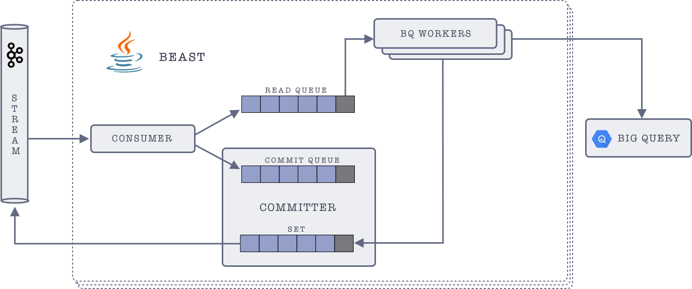

# Beast

[](https://travis-ci.org/gojek/beast)
[](https://codeclimate.com/github/gojekfarm/beast/maintainability)
[](https://codecov.io/gh/gojek/beast)

Kafka to BigQuery Sink

## Architecture

* **Consumer**:
    Consumes messages from kafka in batches, and pushes these batches to Read & Commit queues. These queues are blocking queues, i.e, no more messages will be consumed if the queue is full. (This is configurable based on poll timeout)
* **BigQuery Worker**:
    Polls messages from the read queue, and pushes them to BigQuery. If the push operation was successful, BQ worker sends an acknowledgement to the Committer.
* **Committer**:
    Committer receives the acknowledgements of successful push to BigQuery from BQ Workers. All these acknowledgements are stored in a set within the committer. Committer polls the commit queue for message batches. If that batch is present in the set, i.e., the batch has been successfully pushed to BQ, then it commits the max offset for that batch, back to Kafka, and pops it from the commit queue & set.

<br><div style="text-align:center;width: 90%; margin:auto;"></div><br>

* **Dead Letters**:
    Beast provides a plugable GCS (Google Cloud Storage) component to store invalid out of bounds messages that are rejected by BigQuery. Primarily all messages that are partitioned on a timestamp field and those that contain out of ranges timestamps (year old data or 6 months in future) on the partition key are considered as invalid. Without an handler for these messages, Beast stops processing. The default behaviour is to stop processing on these out of range data. GCS component can be turned on by supplying an environment field as below.
    ```
    ENABLE_GCS_ERROR_SINK=true
    GCS_BUCKET=<google cloud store bucket name>
    GCS_PATH_PREFIX=<prefix path under the bucket>
    ```
    The handler partitions the invalid messages on GCS based on the message arrival date in the format `<dt=yyyy-MM-dd>`. The location of invalid messages on GCS would ideally be `<GCS_BUCKET>/<GCS_PATH_PREFIX>/<dt=yyyy-MM-dd>/<topicName>/<random-uuid>`
    - where <topicName> - is the topic that has the invalid messages
    - <random-uuid> - name of the file

## Building & Running

### Prerequisite
* A kafka cluster which has messages pushed in proto format, which beast can consume
* should have BigQuery project which has streaming permission
* create a table for the message proto
* create configuration with column mapping for the above table and configure in env file
* env file should be updated with bigquery, kafka, and application parameters

## Run locally:
```
git clone https://github.com/gojekfarm/beast
export $(cat ./env/sample.properties | xargs -L1) && gradle clean runConsumer
```

## Run with Docker
The image is available in [gojektech](https://hub.docker.com/r/gojektech/beast) dockerhub.

```
export TAG=80076c77dc8504e7c758865602aca1b05259e5d3
docker run --env-file beast.env -v ./local_dir/project-secret.json:/var/bq-secret.json -it gojektech/beast:$TAG
```
* `-v` mounts local secret file `project-sercret.json` to the docker mentioned location, and `GOOGLE_CREDENTIALS` should match the same `/var/bq-secret.json` which is used for BQ authentication.
* `TAG`You could update the tag if you want the latest image, the mentioned tag is tested well.

## Running on Kubernetes

Create a beast deployment for a topic in kafka, which needs to be pushed to BigQuery.
* Deploymet can have multiple instance of beast
* A beast container consists of the following threads:
  - A kafka consumer
  - Multiple BQ workers
  - A committer
* Deployment also includes telegraf container which pushes stats metrics
Follow the [instructions](https://github.com/gojektech/charts/tree/master/incubator/beast) in [chart](https://github.com/gojektech/charts) for helm deployment

## BQ Setup:
Given a [TestMessage](./src/test/proto/TestMessage.proto) proto file, you can create bigtable with [schema](./docs/test_messages.schema.json)
```
# create new table from schema
bq mk --table <project_name>:dataset_name.test_messages ./docs/test_messages.schema.json

# query total records
bq query --nouse_legacy_sql 'SELECT count(*) FROM `<project_name>:dataset_name.test_messages LIMIT 10'

#  update bq schema from local schema json file
bq update --format=prettyjson <project_name>:dataset_name.test_messages  booking.schema

# dump the schema of table to file
bq show --schema --format=prettyjson <project_name>:dataset_name.test_messages > test_messages.schema.json
```

## Produce messages to Kafka
You can generate messages with TestMessage.proto with [sample-kafka-producer](https://github.com/gojekfarm/sample-kafka-producer), which pushes N messages

## Running Stencil Server
* run shell script `./run_descriptor_server.sh` to build descriptor in `build` directory, and python server on `:8000`
* stencil url can be configured to `curl http://localhost:8000/messages.desc`


# Contribution

* You could raise issues or clarify the questions
* You could raise a PR for any feature/issues
 To run and test locally:
```
git clone https://github.com/gojekfarm/beast
export $(cat ./env/sample.properties | xargs -L1) && gradlew test
```
* You could help us with documentation

